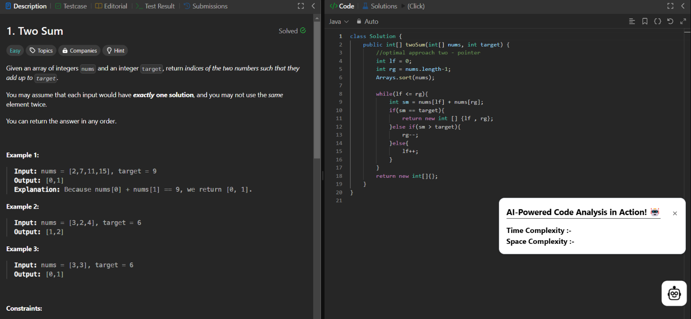
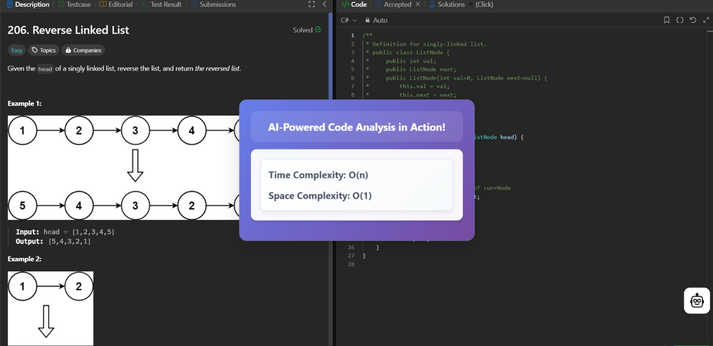

# 📘 CodeScope – Chrome Code Analyzer Extension

---


---

## 📌 Overview

**CodeScope** is a lightweight Chrome extension that helps developers analyze source code directly inside the browser.

It provides insights into:

- 📊 Code **complexity**
- 🧩 Code **structure**
- ⚠️ Potential **problem areas**
- 🔍 Nesting depth, branching, large functions & more

---

## ⭐ Key Features

### 🔍 1. Code Complexity & Hotspot Detection
- Detects heavy, complex blocks of code  
- Highlights deep nesting  
- Shows refactoring candidates  

---

### 🧩 2. Structure Analysis
CodeScope evaluates the architectural shape of your code:

✔ Nesting Depth  
✔ Branching Patterns  
✔ Component / Function Size  
✔ HTML / JS Structure  
✔ Inline Script Detection  

---

### ⚡ 3. Real-Time Browser Analysis
- Works on webpages, editors, and devtools  
- No external setup needed beyond installing the extension  

---

### 🎨 4. Modern UI (React + TypeScript)
- Smooth, clean popup UI  
- Instant feedback while browsing any code  

---

## 📁 Tech Stack

| Layer        | Technology              |
|--------------|-------------------------|
| Frontend     | React, TypeScript       |
| Backend      | Node.js (Utility Modules) |
| Bundler      | Webpack                 |
| Platform     | Chrome Extension (MV3)  |

---

## 📂 Project Structure

```bash
CodeScope/
├── Backend/
│   ├── config/
│   ├── controller/
│   ├── routes/
│   ├── schema/
│   ├── utils/
│   ├── Dockerfile
│   ├── docker-compose.yaml
│   ├── app.ts
│   ├── package.json
│   └── tsconfig.json
│
├── src/
│   ├── components/
│   ├── context/
│   ├── utils/
│   ├── App.tsx
│   ├── content.tsx
│   ├── background.ts
│   └── main.tsx
│
├── public/
│   └── index.html
│
├── icons/
│
├── assets/
│   ├── result1.png
│   └── result2.png
│
├── manifest.example.json
├── webpack.config.js
├── package.json
├── pnpm-lock.yaml
├── .gitignore
├── .env.example
└── README.md
```

---

## 📸 Results

### 🔹 AI Complexity Popup — Example 1  


### 🔹 AI Complexity Popup — Example 2  


---

## 🚀 Getting Started

### 1️⃣ Clone the Repository
```bash
git clone https://github.com/HariKrishna245/Code-Analyzer-Chrome-Extension.git
cd Code-Analyzer-Chrome-Extension
```

### 2️⃣ Install Dependencies
```bash
npm install
```

### 3️⃣ Build the Extension
```bash
npm run build
```

### 4️⃣ Load Into Chrome
1. Go to `chrome://extensions`
2. Enable **Developer Mode**
3. Click **Load Unpacked**
4. Select the `dist` / `build` output folder

---

## 🧭 Roadmap

- 🔘 Improved complexity estimation  
- 🔘 FKGL readability score  
- 🔘 Interactive visualization charts  
- 🔘 Inline webpage highlight mode  
- 🔘 Full AST-powered analysis  
